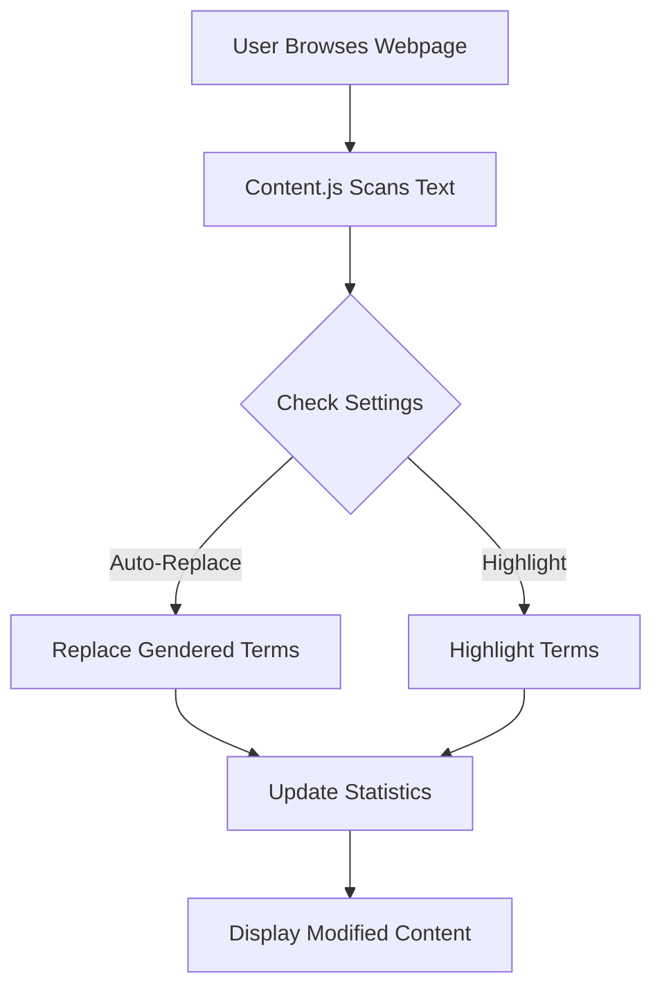
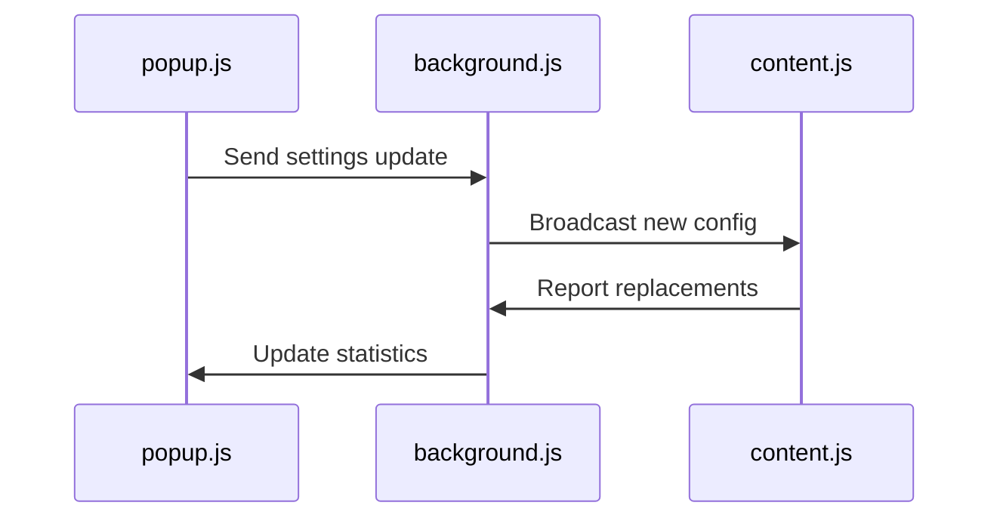

# First_Hackathon_Project--Inclusive_Language_Checker_Chrome_Extension-


```markdown
# 🌐 Inclusive Language Checker Chrome Extension 
**Promote Gender-Neutral Communication with Real-Time AI-Powered Suggestions**

## 🚀 Features
| Feature                      | Description                                                                 |
|------------------------------|-----------------------------------------------------------------------------|
| 🔄 **Real-Time Processing**  | Scans webpages/documents instantly for gendered terms                      |
| 🎯 **Dual Modes**            | Toggle between *Highlight* or *Auto-Replace* modes                         |
| 📊 **Live Analytics**        | Track daily/total inclusive changes via dashboard                          |
| ⚙️ **Custom Dictionary**     | Add/remove terms (e.g., "fireman" → "firefighter")                         |
| 🌈 **Dark Mode**             | Eye-friendly UI with smooth transitions                                    |

---

## 📦 Installation
```bash
# Clone the repository
git clone https://github.com/mdnm18/First_Hackathon_Project--Inclusive_Language_Checker_Chrome_Extension-

# Load in Chrome:
1. Navigate to chrome://extensions
2. Enable "Developer mode" (top-right)
3. Click "Load unpacked" and select the project folder
```

## 🛠️ Architecture Overview
### 📂 File Structure
```
📁 inclusive-language-checker/
├── 📄 manifest.json          → Extension configuration
├── 📄 popup.html             → User interface (HTML)
├── 📄 style.css              → Styling for UI
├── 📄 popup.js               → Core logic & settings
├── 📄 content.js             → Real-time webpage text processing
├── 📄 background.js          → Cross-script communication
└── 📁 images/                → Icons & diagrams
```

### 🔄 Workflow Diagram


## ⚙️ Technical Breakdown
### 🔗 File Interconnections
| File               | Role                                  | Key Dependencies         |
|--------------------|---------------------------------------|--------------------------|
| `manifest.json`    | Extension blueprint                  | All files                |
| `popup.html`       | UI for settings & stats              | `style.css`, `popup.js`  |
| `content.js`       | Real-time text processing            | `popup.js` (settings)    |
| `background.js`    | Handles cross-script messaging       | `popup.js`, `content.js` |

### 📡 Inter-File Communication


## 🌟 Key Technical Features
1. **Dynamic Content Handling**  
   Uses `MutationObserver` to track webpage changes in real-time.

2. **Context-Aware Replacement**  
   Preserves capitalization (e.g., "Chairman" → "Chairperson").

3. **Persistent Storage**  
   ```javascript
   chrome.storage.local.set({ key: value });  // Save settings
   chrome.storage.local.get(['key'], callback);  // Retrieve data
   ```
4. **Real-Time Text Processing**  
```javascript
// content.js
const observer = new MutationObserver((mutations) => {
  mutations.forEach((mutation) => processNewNodes(mutation.addedNodes));
});
observer.observe(document.body, { childList: true, subtree: true });
```

5. **Cross-File Communication**  
```javascript
// popup.js ↔ background.js
chrome.runtime.sendMessage({ action: "fetchData" }, (response) => {
  console.log("Background script response:", response.data);
});
```

6. **Custom Dictionary System**  
```javascript
// popup.js
state.customTerms = {
  "chairman": "chairperson",
  "policeman": "police officer"
};
chrome.storage.local.set({ customTerms: state.customTerms });
```

## 🤝 Contributing
We welcome contributions! Please follow our guidelines:
1. Fork the repository
2. Create a feature branch (`git checkout -b feature/AmazingFeature`)
3. Commit changes (`git commit -m 'Add AmazingFeature'`)
4. Push to branch (`git push origin feature/AmazingFeature`)
5. Open a Pull Request

## 📄 License
Distributed under MIT License. See `LICENSE` for details.

---

Made with ❤️ by #TheCodeBreakers | [SRMIST](https://www.srmist.edu.in/)
```

> **Note**: Replace placeholder links (GitHub repo, Chrome Web Store, demo GIF) with actual project links. For full Mermaid diagram support, ensure your GitHub repository has Mermaid enabled in Markdown preview.
